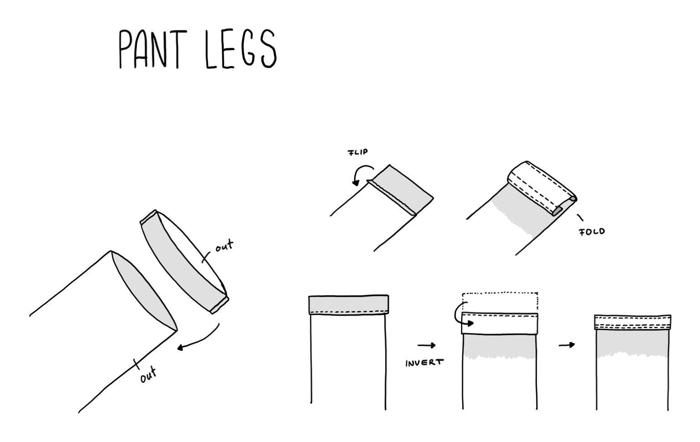

# Pant Legs

Sewing my first pants and learning how to make legs.

## Introduction

Was finishing the first pant and learing how to make using nettle fabric.
It is nice to see how it all comes together piece by piece.

## Technique

Used the technique that was used for the pockets again to finish the end of the pant.
You take the pant with normals facing outside and add a band that is inverted to the bottom. 
Then you sew it so that it is flush with the ending of it using a small distance to the edge.
After that you invert the pant and fold the attatched piece inside.
That piece is then folded again an sewed with on stitch at the end of the pant and two stitches at the part facing in.
Then you need to invert and iron once to make it look straight.

## Drawing

## Learnings

- Sewing a piece with nettle first helps to understand the steps needed
- You can attach fabric to a piece and cut it to the length needed