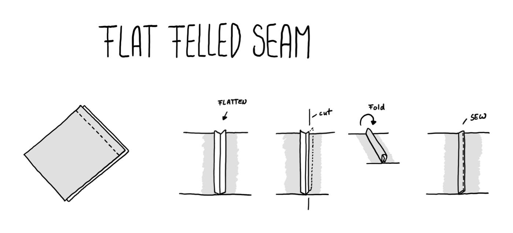

# Flat Felled Seam

Using a flat felled seam to connect two pieces of fabric.

## How it works

You sew together two pieces of fabric with the required seam allowance.

Then you invert it and spread the inside parts from the allowance to both sides and iron that.

When done you cut away a bit more than half of the fabric from one side.

After that you fold the longer part around that half and flip it to have the open part in the inside.

Than you sew the edge of that part in place.

## Drawing

## Learnings

- There are many ways to connect the edge of a seam
- Each seam is suitable for a different purpose and fabric