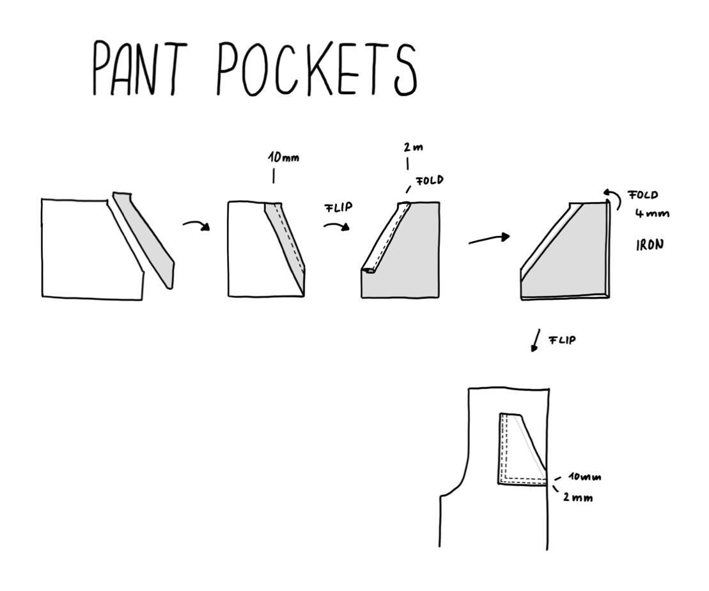

# Pant Pockets

First steps in making the pants with cotton by adding the pockets to the legs.

## Instructions

Was starting to sew the pant with cotton textile.

Had done it before with nettle to see how it works.

Did the pockets and attatched them to the front parts of the pants.

## Drawing

## Learnings

- Tracing patterns is done on thin paper and cut with roller through thicker paper
- It needs practice to create parallel seams