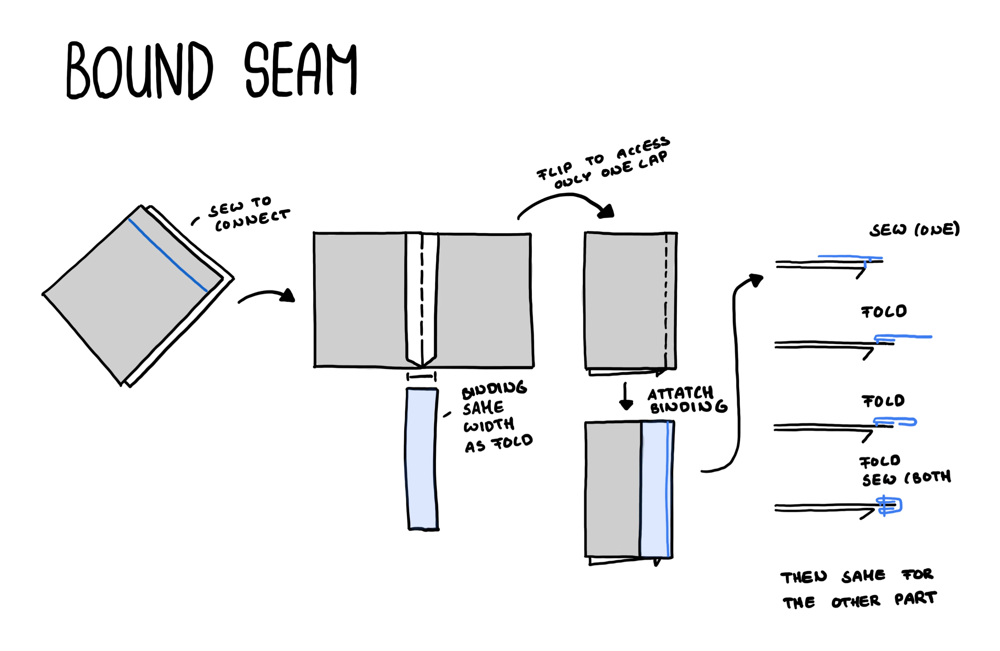

# Bound Seam

The bound seam (or bias bound seam) is a way to protect the edges after connecting two pieces of fabric.
It involves wrapping a binding piece around the end of the seam allowance.

Its hard to explain, but [this video](https://www.youtube.com/watch?v=AC38yqMxMns) shows the process in detail.

## Drawing

## Learnings

- There are many different ways to protect seams
- The bound seam is slightly difficult to explain